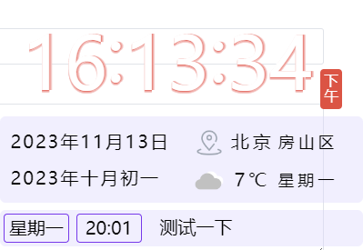
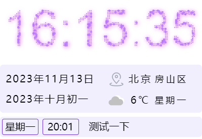
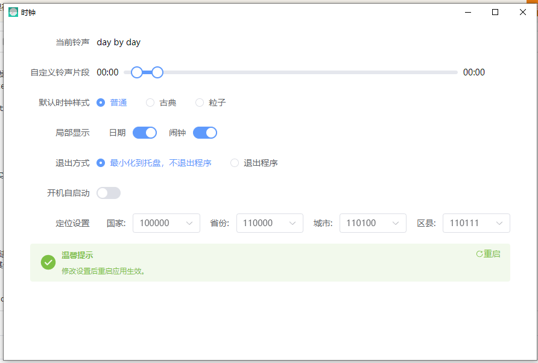
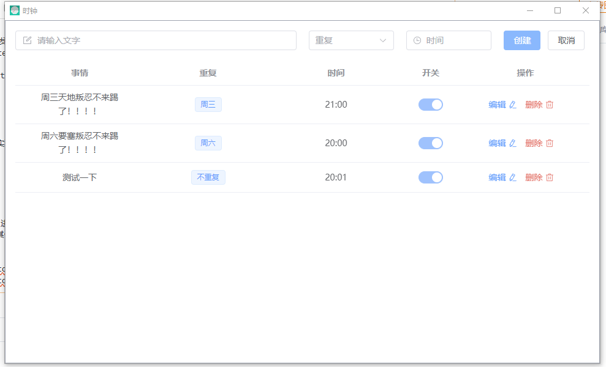

# kkClock-pc
一款基于electron 开发的桌面时钟
技术栈采用 Vue3、Vite、TypeScript、tailWindCss、element-plus、Electron、Electron-builder等。

用来作为一款学习electron的练手项目，目前实现了以下功能：
1. 桌面时钟
目前实现两种、
1.1 普通时钟
1.2 粒子时钟
2.闹钟功能
通过node-scheduler实现
3. 天气信息功能
通过高德地图api实现
4. 基本设置

## 安装
使用git克隆到本地
通过 npm run build 进行打包，release 文件夹即应用.unpacked为 免安装版本 打开即可体验
目前仅支持win系统，其他系统未做适配。

## 界面展示

